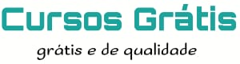

<h1 align="center">
    
</h>

# Sobre

## Projeto Site
***
 Este projeto foi desenvolvido durante o curso de **Git e GitHub**, do **Curso em Vídeo**.

 Trata-se de um site simples iniciado na aula 12 e finalizado na aula 13.

## Tecnologias usadas:
 * **[HTML](https://developer.mozilla.org/pt-BR/docs/Web/HTML)**
 * **[CSS](https://developer.mozilla.org/pt-BR/docs/Learn/CSS/First_steps/O_que_e_CSS)**
 * **[Markdown](https://daringfireball.net/projects/)**

## Farramentas:
 * **[Visual Studio Code](https://code.visualstudio.com/)**
 * **[Git](https://git-scm.com/)**
 * **[GitHub](https://github.com/)**
 * **[GitHub Desktop - for Linux](https://desktop.github.com/)**

## Recursos ultilizados:
 * **[GitHub Pages](https://pages.github.com/)**
 
## Licença:
This project is licensed under the MIT License - see the [LICENSE](https://opensource.org/licenses/MIT) page for details.
***
## Agradecimentos:
* **[Prof. Gustavo Guanabara](https://github.com/gustavoguanabara)**